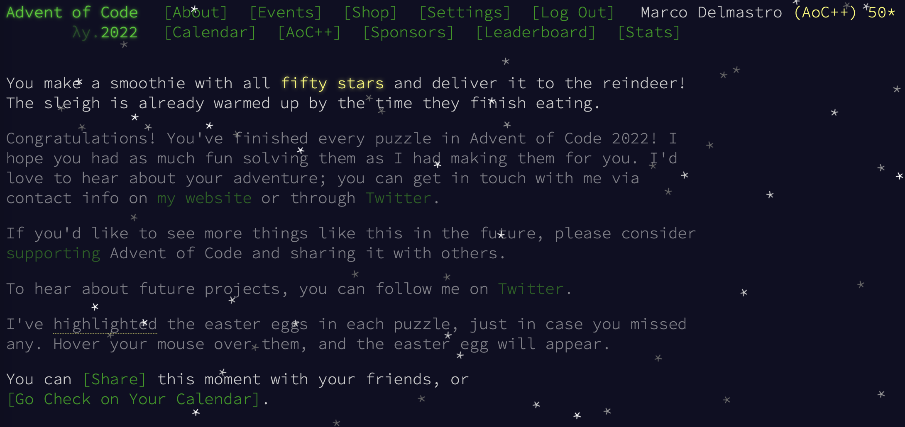
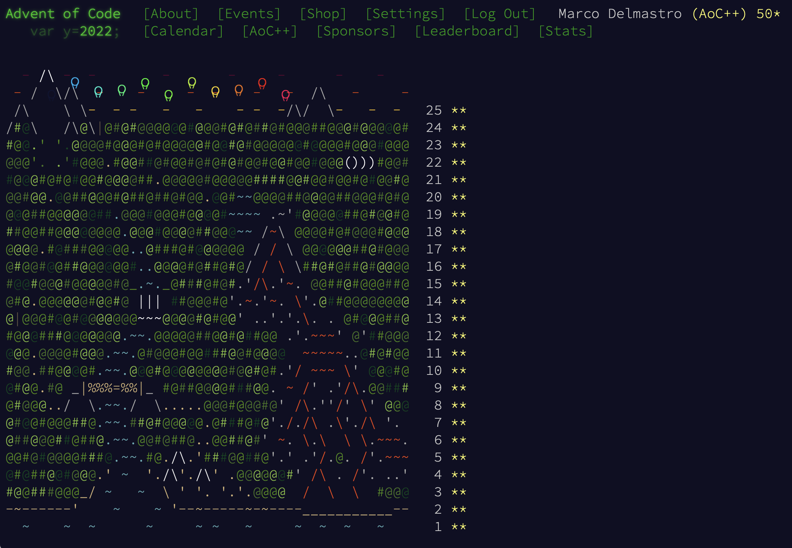

# Advent Of Code 2022

* [Day 1](Day01.ipynb). File reading and simple list manipulation.

* [Day 2](Day02.ipynb). Dictionaries for a Rock-Paper-Scissor game.

* [Day 3](Day03.ipynb). String manipulation and search. Initially using `Counter` and `&` of dictionaries for efficient search of common items, then moved to `set`'s since they are the most natural tool for intersection search.

* [Day 4](Day04.ipynb). Interval overlaps. Quick solution checking extremes.

* [Day 5](Day05.ipynb). The hardest part was parsing the input (done in a very not elegant way :-) I could do much better if I only knew how to really use `regex`). Solutions were variations of list chopping and reassembling.

* [Day 6](Day06.ipynb). String chopping and sets.

* [Day 7](Day07.ipynb). First day presenting some challenge. Parsing the commands to browse the filesystem was not too complicated, structure saved in dictionary of dictionaries (for directories) and integers (for file sizes). Part 1 solved with recursion, Part 2 was quite easy since I was already saving the sizes of all directories.

* [Day 8](Day08.ipynb). `numpy` array slicing and manipulation.

* [Day 9](Day09.ipynb). Coordinate tracking and relative movement. Part 1 was fast, Part 2 more complicated by the fact that my initial implementation of a the head-tail relative movement was not accounting for all possibilities that can show up in a longer rope.

* [Day 10](Day10.ipynb). Another programming language! Careful cycle counts and screen drawing...

* [Day 11](Day11.ipynb). First use of a `class`. Part 2 required to use a mathematical trick not to let the worry level to explode...

* [Day 12](Day12.ipynb). Path finding on a oriented graph. Caching of already-explored paths needed to speed-up second part

* [Day 13](Day13.ipynb). Recursion for Part 1 to implement `compare` function. `functools.cmp_to_key` to use Part 1 `compare` function in standard sorting algorithm for Part 2. After initial solution, also added simple bubble sort implementation.

* [Day 14](Day14.ipynb). Sand dropping in a cave until if flows forever or it fills the hole! Representing cave walls and sand in dictionary avoids having to use large arrays of potentially unknown size (especially for Part 2)

* [Day 15](Day15.ipynb). 2D areas with Manhattan distance, with overlap and intercepts to be calculated. Using `set` works fast enouhg for Part 1, bus as expected this does not scael for Part 2, where handling overlpas in term of ranges is needed.

* [Day 16](Day16.ipynb). Solving Part 1 with a mixture of cached BFS results and graph traversing following the rules. Extending the solution to Part 2 took me some thinking (see notebook for details)

* [Day 17](Day17.ipynb). Tetris simulation. Part 1 done quickly on New Year's Day morning before the family wakes up. Part 2 can be solved by looking for repetion and exploting them to compute the tower height without haing to drop the huge number of rocks: I solved this on January 2nd 2023 after some struggle: I got the right idea quickly, but failed to realise that a single repetition does not make a cycle, and only multiple occurrences at regular intervals guarantee that I found the right period. Once realised, fixing the code was quick.

* [Day 18](Day18.ipynb). Part 1 was quick and easy using geometry considerations. Part 2 solved by searching for non-isolated pockets to remove them from internal surface calculation.

* [Day 19](Day19.ipynb). A well-disguised graph traversing problem: implementation was quite tricky (using a BFS-like search to produce all states), but even trickier was finding the optimisation to prune the useless states not to explose the search space. This was definitively the tougher problem for me this year. Finished to solve on January 4, 2023.

* [Day 20](Day20.ipynb). Linked list with the usual menace of huge numbers for part 2/

* [Day 21](Day21.ipynb). Simple recursive solution for Part 1, dicotomic search + brute force around minumum for Part 2. Added semi-analytical solution using `sympy` to simplify the mathematical expression after the initial solution.

* [Day 22](Day22.ipynb). 2D grid navigation: Part 1 needs wrapping across empty space; Part 2 treats map as cube surface.

* [Day 23](Day23.ipynb). A puzzle similar to Conway’s game of Life with some peculiar rules. I overcomplicated the parsing function to “ease” the visualization, only to include a off-by-one error (the first line of the input was not read!) that was thankfully quickly found on Reddit. Once fixed all the rest worked out of the box for both Part 1 and Part 2.

* [Day 24](Day24.ipynb). Path finding on an evolving map, with the possibility not to move. Since the map configurations are repeating, I pre-computed and cache them. Solution is a simple BFS; Part 2 basically runs part 1 solution 3 times with different starting configurations and goals. Done on New Year's Eve morning (this was one of the 3 days I left behind during the Advent period for lack of time).

* [Day 25](Day25.ipynb). Convert values to a different base with a spin.

